# VMRay Connector for Chronicle SOAR

**Latest Version:** 1.0 - **Release Date:** February 20, 2023

## Overview

This project aims to integrate Chronicle SOAR and VMRay Analyzer to use VMRay's detailed threat analysis features in playbooks.

## Actions

The following actions can be used in playbooks with this integration.

- **Submit Sample** : Submits suspicious file to VMRay Analyzer and retrieve submission information.
- **Submit URL** : Submits suspicious URL to VMRay Analyzer and retrieve submission information.
- **Submit Hash** : Submits hash of the suspicious file to retrieve sample information.
- **Get Submission Result** : Retrieves submission status for a given submission id.
- **Get Analysis Archive** : Retrieves analysis archive file for a given sample id or analysis id.
- **Get Child Samples** : Retrieves child samples for a given sample identifier (useful for archive submissions).
- **Get Sample IOCs** : Retrieves Indicator of Compromise values for a given sample id.
- **Get Sample VTIs** : Retrieves VMRay Threat Identifiers for a given sample id.
- **Get Sample Report** : Retrieves PDF analysis report of a given sample id.
- **Unlock Reports for the Sample** : Unlocks report for the sample which was already analyzed with he Verdict API.
- **Ping** : Checks availability and authentication status for the VMRay API.

## Submit Sample (Async)

Submits suspicious file to VMRay Analyzer and retrieve submission information.

| Field | Default Value |
|-----|-----|
| Description | Submit suspicious file to VMRay Analyzer and retrieve submission information |
| Output Name | `is_success` |
| Include JSON Result | `TRUE` |
| Script Timeout | `10 Minutes` |
| Async Action Timeout | `1 Hours` |
| Async Polling Interval | `1 Minute` |
| Timeout Default Return Value | `Submit Sample Action timeout exceeded.` |

| Parameter | Type | Default Value | Mandatory | Description |
|-----|-----|-----|-----|-----|
| FILE_PATH | `String` | `DEFAULT_VALUE` | `TRUE` | Absolute file path of sample |
| SUBMISSION_COMMENT | `String` | `N/A` | `FALSE` | Comment for submissions |
| TAGS | `String` | `N/A` | `FALSE` | Tags for submission (comma seperated string) |
| ANALYSIS_TIMEOUT | `String` | `120` | `FALSE` | VMRay analysis timeout value (seconds) |
| ANALYZER_MODE | `String` | `reputation_static_dynamic` | `FALSE` | VMRay analyzer mode for sample (Possible values: reputation, reputation_static, reputation_static_dynamic, static_dynamic, static ) |

## Submit URL (Async)

Submits suspicious URL to VMRay Analyzer and retrieve submission information.

| Field | Default Value |
|-----|-----|
| Description | Submit suspicious URL to VMRay Analyzer and retrieve submission information |
| Output Name | `is_success` |
| Include JSON Result | `TRUE` |
| Script Timeout | `10 Minutes` |
| Async Action Timeout | `1 Hours` |
| Async Polling Interval | `1 Minute` |
| Timeout Default Return Value | `Submit URL Action timeout exceeded.` |

| Parameter | Type | Default Value | Mandatory | Description |
|-----|-----|-----|-----|-----|
| URL | `String` | `DEFAULT_VALUE` | `TRUE` | Url value which will be analyzed |
| SUBMISSION_COMMENT | `String` | `N/A` | `FALSE` | Comment for submissions |
| TAGS | `String` | `N/A` | `FALSE` | Tags for submission (comma seperated string) |
| ANALYSIS_TIMEOUT | `String` | `120` | `FALSE` | VMRay analysis timeout value (seconds) |
| ANALYZER_MODE | `String` | `reputation_static_dynamic` | `FALSE` | VMRay analyzer mode for sample (Possible values: reputation, reputation_static, reputation_static_dynamic, static_dynamic, static ) |

## Submit Hash

Submits hash of the suspicious file to retrieve sample information.

| Field | Default Value |
|-----|-----|
| Description | Submits hash of the suspicious file to retrieve sample information |
| Output Name | `is_success` |
| Include JSON Result | `TRUE` |
| Script Timeout | `1 Minute` |
| Timeout Default Return Value | `Sumbit Hash Action timeout exceeded.` |

| Parameter | Type | Default Value | Mandatory | Description |
|-----|-----|-----|-----|-----|
| HASH | `String` | `DEFAULT_VALUE` | `TRUE` | Hash value of sample |

## Get Submission Result

Retrieves submission status for a given submission id.

| Field | Default Value |
|-----|-----|
| Description | Retrieve submission status for a given submission id |
| Output Name | `is_success` |
| Include JSON Result | `TRUE` |
| Script Timeout | `1 Minute` |
| Timeout Default Return Value | `Get Submission Result Action timeout exceeded.` |

| Parameter | Type | Default Value | Mandatory | Description |
|-----|-----|-----|-----|-----|
| SUBMISSION_ID | `String` | `DEFAULT_VALUE` | `TRUE` | Identifier of submission |

## Get Analysis Archive

Retrieves analysis archive file for a given sample id or analysis id.

| Field | Default Value |
|-----|-----|
| Description | Retrieve analysis archive file for a given sample or analysis id |
| Output Name | `is_success` |
| Include JSON Result | `TRUE` |
| Script Timeout | `1 Minute` |
| Timeout Default Return Value | `Get Analysis Archive Action timeout exceeded.` |

| Parameter | Type | Default Value | Mandatory | Description |
|-----|-----|-----|-----|-----|
| SAMPLE_ID | `String` | `N/A` | `FALSE` | Identifier of submitted sample |
| ANALYSIS_ID | `String` | `N/A` | `FALSE` | Identifier of analysis of submitted sample |

## Get Child Samples

Retrieves child samples for a given sample identifier (useful for archive submissions).

| Field | Default Value |
|-----|-----|
| Description | Retrieve child samples for a given sample identifier (useful for archive submissions) |
| Output Name | `is_success` |
| Include JSON Result | `TRUE` |
| Script Timeout | `1 Minute` |
| Timeout Default Return Value | `Get Child Samples Action timeout exceeded.` |

| Parameter | Type | Default Value | Mandatory | Description |
|-----|-----|-----|-----|-----|
| SAMPLE_ID | `String` | `DEFAULT_VALUE` | `TRUE` | Identifier of submitted sample |

## Get Sample IOCs

Retrieves Indicator of Compromise values for a given sample id.

| Field | Default Value |
|-----|-----|
| Description | Retrieve Indicator of Compromise values for a given sample id |
| Output Name | `is_success` |
| Include JSON Result | `TRUE` |
| Script Timeout | `1 Minute` |
| Timeout Default Return Value | `Get Sample IOCs Action timeout exceeded.` |

| Parameter | Type | Default Value | Mandatory | Description |
|-----|-----|-----|-----|-----|
| SAMPLE_ID | `String` | `DEFAULT_VALUE` | `TRUE` | Identifier of submitted sample |
| SELECTED_IOC_VERDICTS | `String` | `malicious,suspicious` | `FALSE` | Selected verdicts of IOCs (comma seperated string) |
| SELECTED_IOC_TYPES | `String` | `domains,files,filenames,ips,mutexes,processes,registry,urls` | `FALSE` | Selected types of IOCs (comma seperated string) |
| CREATE_INSIGHT | `Boolean` | `FALSE` | `FALSE` | Boolean value to determine creation of case insight |

## Get Sample VTIs

Retrieves VMRay Threat Identifiers for a given sample id

| Field | Default Value |
|-----|-----|
| Description | Retrieve VMRay Threat Identifiers for a given sample id |
| Output Name | `is_success` |
| Include JSON Result | `TRUE` |
| Script Timeout | `1 Minute` |
| Timeout Default Return Value | `Get Sample VTIs Action timeout exceeded.` |

| Parameter | Type | Default Value | Mandatory | Description |
|-----|-----|-----|-----|-----|
| SAMPLE_ID | `String` | `DEFAULT_VALUE` | `TRUE` | Identifier of submitted sample |
| MIN_VTI_SCORE | `String` | `3` | `FALSE` | Minimum score of retrieved VMRay Threat Identifiers |
| CREATE_INSIGHT | `Boolean` | `FALSE` | `FALSE` | Boolean value to determine creation of case insight |

## Get Sample Report

Retrieves PDF analysis report of a given sample id.

| Field | Default Value |
|-----|-----|
| Description | Retrieve PDF analysis report of a given sample id |
| Output Name | `is_success` |
| Include JSON Result | `TRUE` |
| Script Timeout | `1 Minute` |
| Timeout Default Return Value | `Get Sample Report Action timeout exceeded.` |

| Parameter | Type | Default Value | Mandatory | Description |
|-----|-----|-----|-----|-----|
| SAMPLE_ID | `String` | `DEFAULT_VALUE` | `TRUE` | Identifier of submitted sample |
| CREATE_INSIGHT | `Boolean` | `FALSE` | `FALSE` | Boolean value to determine creation of case insight |

## Unlock Reports for the Sample

Unlocks report for the sample which was already analyzed with he Verdict API.

| Field | Default Value |
|-----|-----|
| Description | Unlock report for the sample which was already analyzed with he Verdict API |
| Output Name | `is_success` |
| Include JSON Result | `TRUE` |
| Script Timeout | `1 Minute` |
| Timeout Default Return Value | `Unlock Reports for the Sample Action timeout exceeded.` |

| Parameter | Type | Default Value | Mandatory | Description |
|-----|-----|-----|-----|-----|
| SAMPLE_ID | `String` | `DEFAULT_VALUE` | `TRUE` | Identifier of submitted sample |

## Ping

Checks availability and authentication status for the VMRay API.

| Field | Default Value |
|-----|-----|
| Description | Check availability and authentication status for the VMRay API. |
| Output Name | `is_success` |
| Include JSON Result | `TRUE` |
| Script Timeout | `1 Minute` |
| Timeout Default Return Value | `Ping Action timeout exceeded.` |

## Related VMRay Products

The connector supports following VMRay products:

- Final Verdict
- Total Insight

## Installation

Clone the repository into a local folder and compress folders/files as `zip` file.

    git clone https://github.com/vmray/chronicle-soar.git

Login to the Chronicle SOAR and click the `IDE` button on the upper right side.

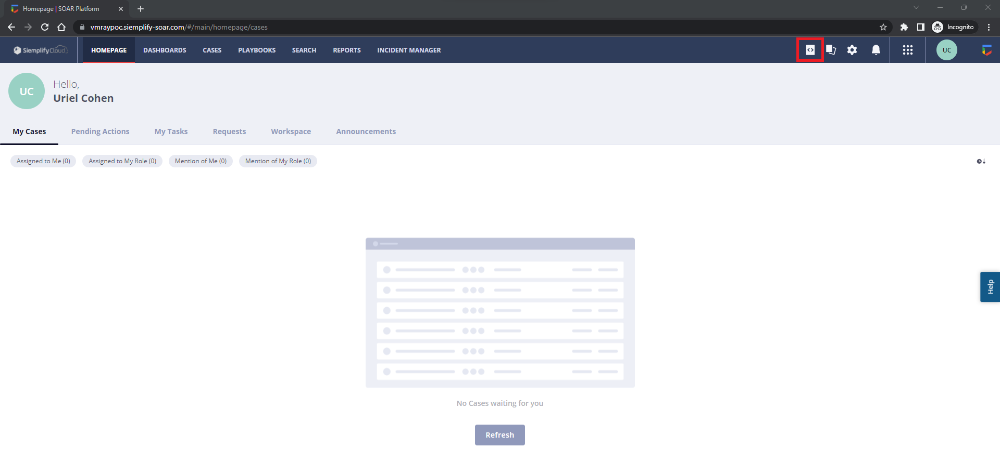

Click the button on the upper left side and click `Import Package`.

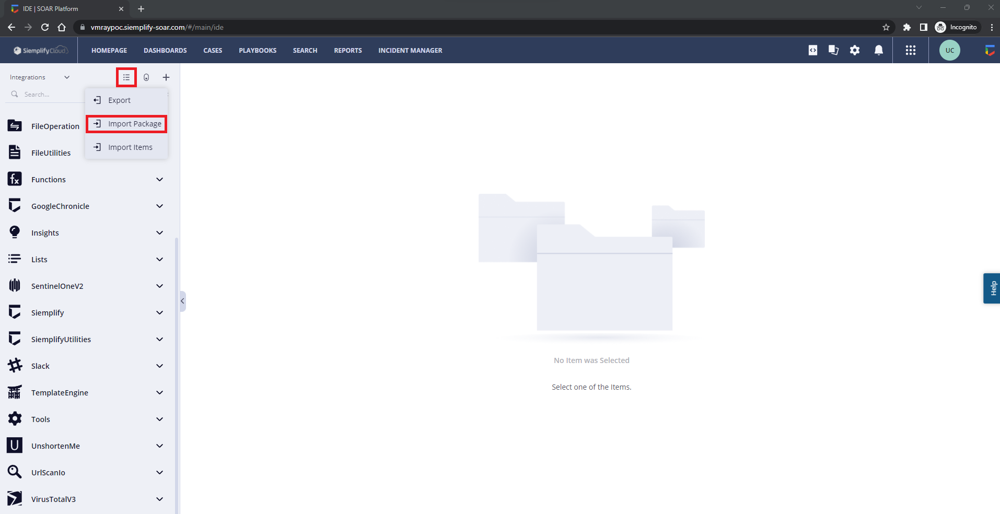

Check the content of the integration package and click the `Import` button.

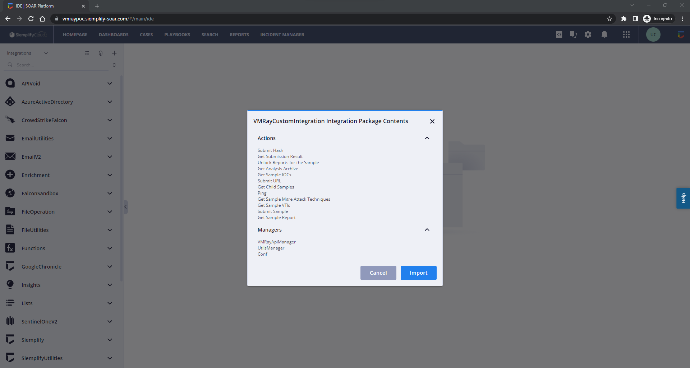

You can view the integration details and source code with the sidebar.

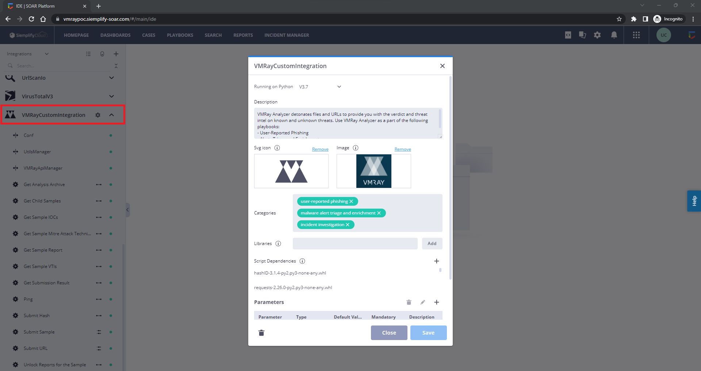

Click the `Marketplace` button on the upper right side.

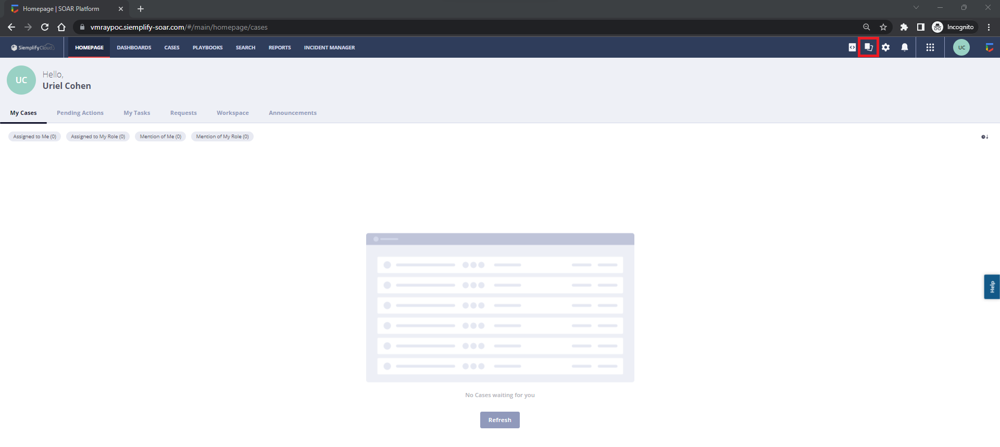

Select imported integration from the `Integrations` page and click the `Configure` button.

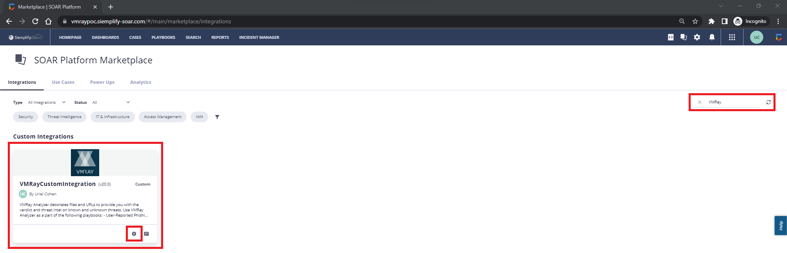

Fill `API_KEY (VMRay API Key)`, `URL (VMRay Console Url)`, and `SSL_VERIFY` inputs and save the configuration.

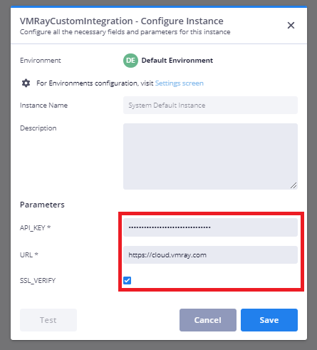

After these steps, you can use `Integration Actions` in your playbooks.

## Example Playbook

Open the `Playbooks` page and click the `Add` button on the upper left side to create a new playbook.

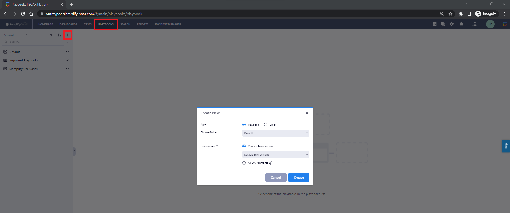

Open the `Actions` page and search for `VMRayCustomIntegration` to find integration Actions.

**Note**: Custom trigger is used to simulate a real trigger for demo purposes.

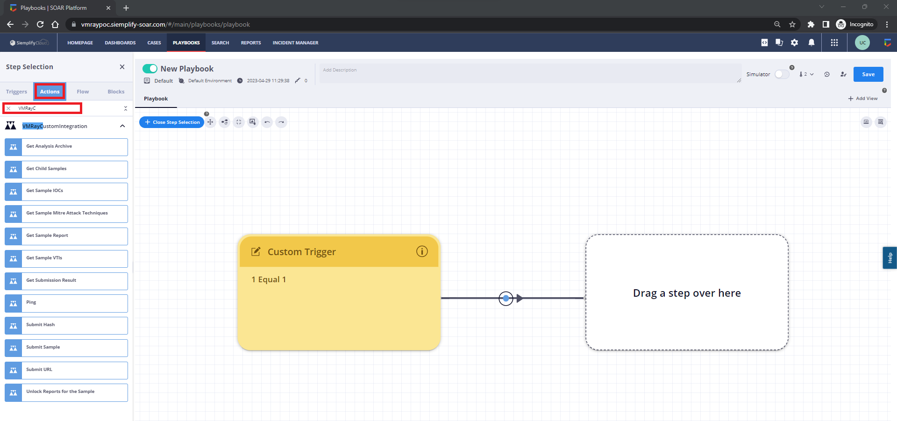

Drag and Drop the `Submit Hash` action and configure the parameters.

**Note**: Sample hash value is filled manually for demo purposes.

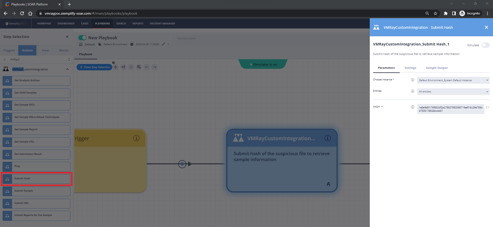

Also, you can analyze the `Sample Output` of the action.

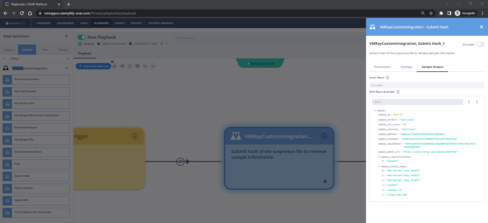

Drag and Drop the `Get Sample IOCs` action and configure the parameters. Click the `[]` button to configure `SAMPLE_ID` with output from the other actions.

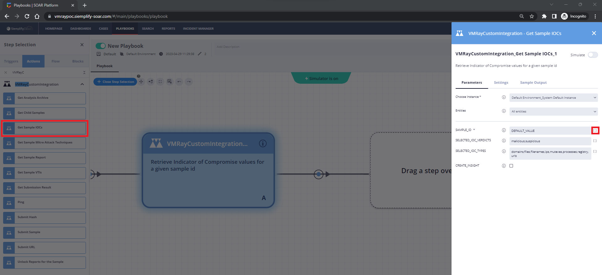

Select the `JsonResult` of the `Submit Hash` action.

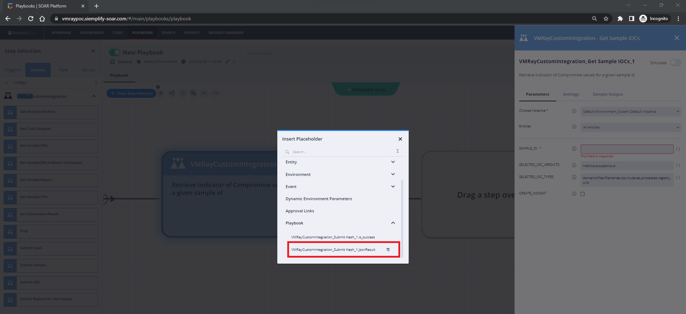

Select the `sample_id` from the placeholder. You can test the expression with the `Run` button. Finally, click the `Insert` button to save the expression.

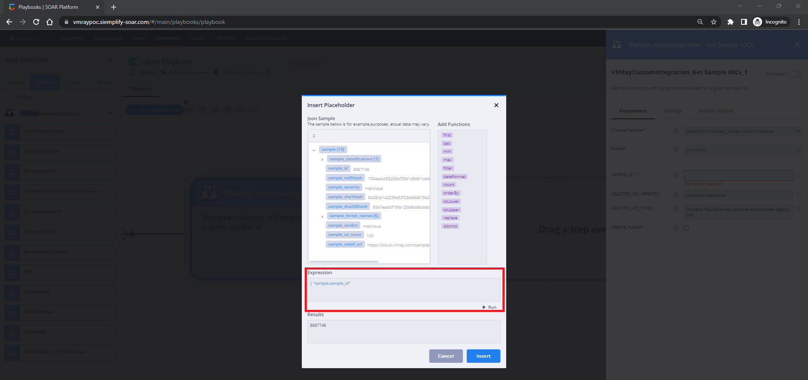

You can see the expression that extracts the `SAMPLE_ID` value from the other action.

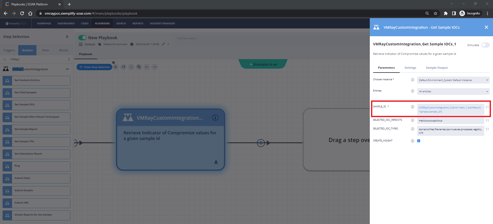

You can test this playbook with the `Run` button below in `Simulation` mode.

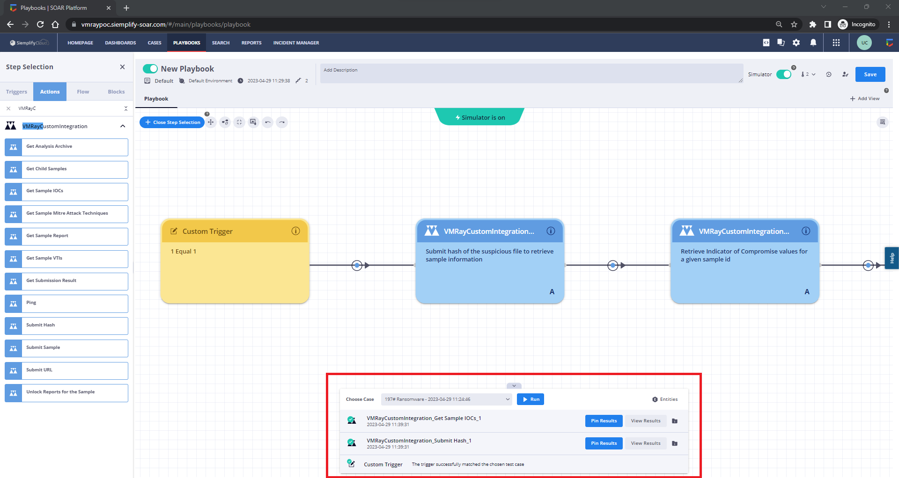

You can analyze the playbook and actions result from the pane below.

Results of the `Submit Hash` action.

Results of the `Get Sample IOCs` action.

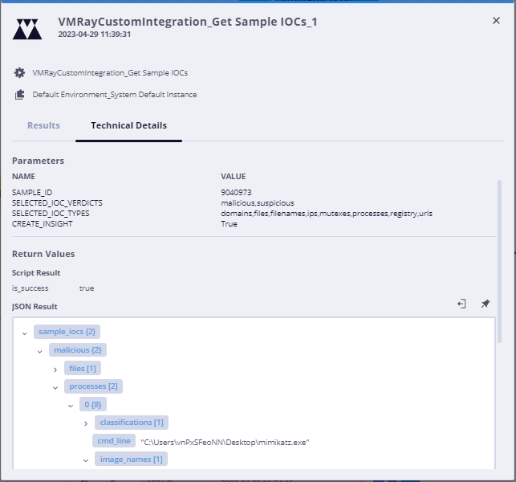